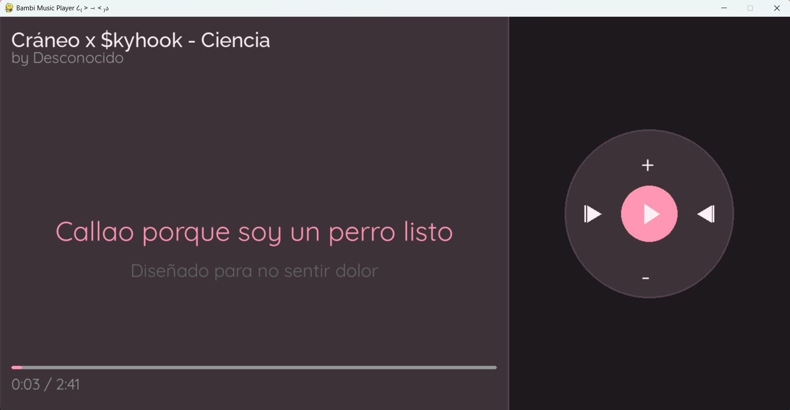

# 🎵 Bambi Music Player ૮₍ ˃ ⤙ ˂ ₎ა

A minimalist music player with synchronized lyrics, featuring a horizontal iPod-style interface in pastel pink colors.



## ✨ Features

-  **Synchronized Lyrics** - Real-time lyrics display using .lrc files
-  **Interactive Playlist** - Click to select songs
-  **iPod-style Interface** - Horizontal design with circular controls
-  **Keyboard & Mouse Controls** - Multiple ways to control playback
- **Progress Bar** - Playback time visualization
- **Pastel Pink Theme** - Aesthetic design with custom fonts

##  Requirements

- Python 3.12.7
- Required libraries:
  - pygame
  - mutagen

##  Installation

1. Clone the repository:
```bash
git clone https://github.com/Bambi-uxx/Bambi-Music-Player.git
cd Bambi-Music-Player
```

2. Install dependencies:
```bash
pip install pygame mutagen
```

3. Configure your paths in `config.py`:
```python
MUSIC_FOLDER = "C:/path/to/your/music"
```

##  How to Add Songs and Lyrics

### Songs
1. Place your music files (.mp3, .ogg) in the folder configured in `MUSIC_FOLDER`
2. The player will automatically load all songs from the folder

### Synchronized Lyrics (.lrc)
1. Place .lrc files in the `lyrics/` folder
2. **Important:** The .lrc filename must match exactly with the song name
   - Example: `Song.mp3` → `Song.lrc`
3. .lrc file format:
```
[00:12.50]First line of lyrics
[00:15.80]Second line of lyrics
[00:18.20]Third line of lyrics
```

**Tip:** You can find .lrc files on sites like:
- https://www.megalobiz.com/lrc/
- https://lrclib.net/

##  Controls

### Keyboard
- `SPACE` - Play/Pause
- `←` - Previous song
- `→` - Next song
- `TAB` - Toggle between lyrics and playlist view
- `S` - Stop

### Mouse
- Click on **center button** - Play/Pause
- Click on **left arrow** - Previous song
- Click on **right arrow** - Next song
- Click on **+** - Volume up
- Click on **-** - Volume down
- Click on **playlist songs** - Play song

##  Running the Player
```bash
python main.py
```

Or from your favorite IDE, run `main.py`

## 🎨 Customization

You can customize colors and sizes by editing `config.py`:
- Theme colors
- Font sizes
- Window dimensions
- Element positions

## 📁 Project Structure
```
Bambi_music_player/
├── assets/
│   └── fonts/           # Custom fonts
├── lyrics/              # .lrc files
├── config.py            # Configuration
├── main.py              # Main file
├── player.py            # Player logic
├── playlist.py          # Playlist management
├── lyrics_manager.py    # Lyrics management
└── README.md
```

##  Author

**Bambiux**
- GitHub: [@Bambi-uxx](https://github.com/Bambi-uxx)

##  License

This project is open source and available under the MIT License.

---

💕 Made with love and Python uwu